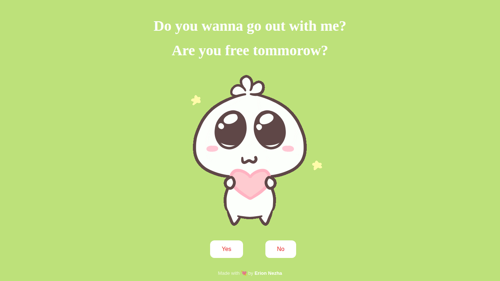

# 💘 Ask Her Out

**Live demo:** https://erionnezha.github.io/Ask-Her-Out/

Një faqe gazmore interaktive për ta bërë pyetjen e madhe: *"Do you wanna go out with me?"* — butoni **No** ikën sa herë që përpiqesh ta klikosh, kështu që përgjigjja e vetme e mundur është **Yes**! 🥰

## ✨ Karakteristikat

- 😏 Butoni "No" që lëviz dhe i shmanget kursorit
- 🎉 Faqe festive "Hurrayyyy!!" pas klikimit të "Yes"
- 🖼️ GIF-e gazmore nga Giphy

## 🛠️ Teknologjitë

HTML5 · CSS3 · JavaScript (vanilla)

## 📄 Licenca

**© 2026 Erion Nezha.** Ky projekt shpërndahet nën licencën MIT — shih [LICENSE](LICENSE).
> **Shënim:** Formati "pyetje romantike me butonin 'No' që ikën" është një meme/shaka e përhapur në internet — ky version është përshtatur dhe organizuar posaçërisht për këtë faqe.

---

# 💘 Ask Her Out

**Live demo:** https://erionnezha.github.io/Ask-Her-Out/

A playful interactive page for popping the big question: *"Do you wanna go out with me?"* — the **No** button dodges away every time you try to click it, so the only possible answer is **Yes**! 🥰

## ✨ Features

- 😏 A "No" button that runs away from your cursor
- 🎉 A celebratory "Hurrayyyy!!" page after clicking "Yes"
- 🖼️ Fun GIFs via Giphy

## 🛠️ Built with

HTML5 · CSS3 · JavaScript (vanilla)

## 📄 License

**© 2026 Erion Nezha.** This project is distributed under the MIT license — see [LICENSE](LICENSE).
> **Note:** The "romantic question with a dodging 'No' button" format is a widespread internet meme/joke — this version has been adapted and arranged specifically for this page.

